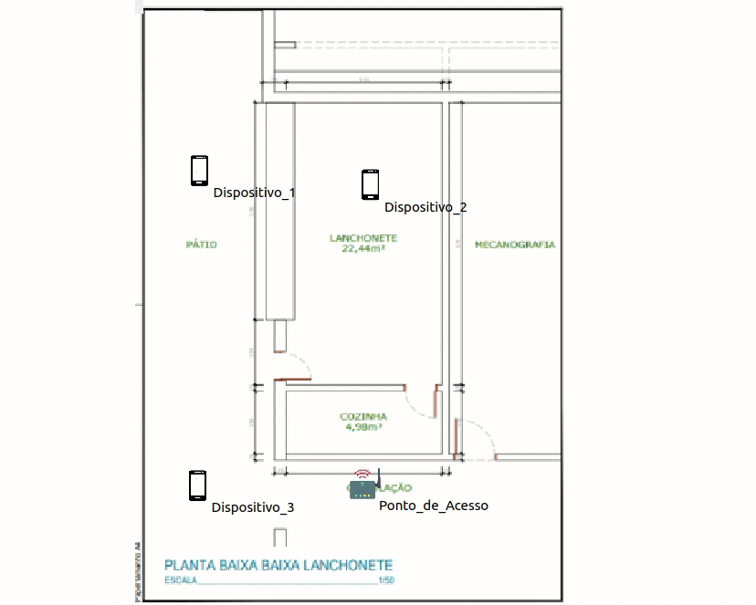
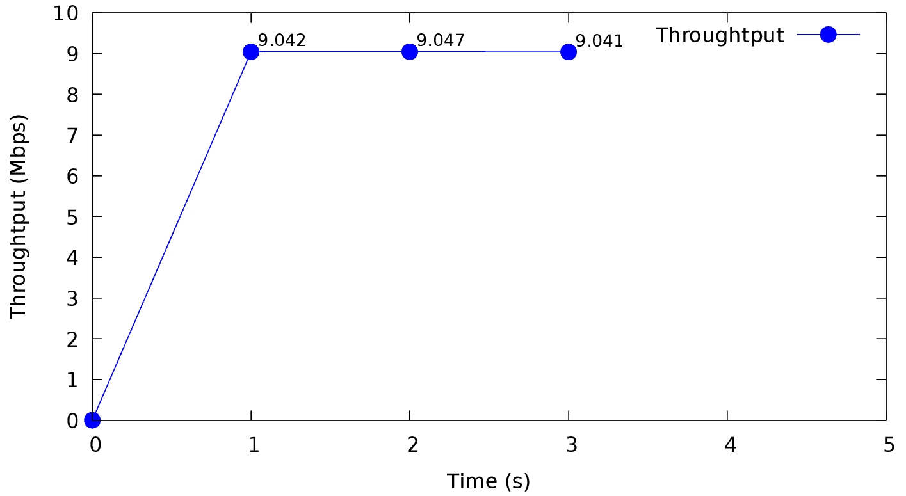
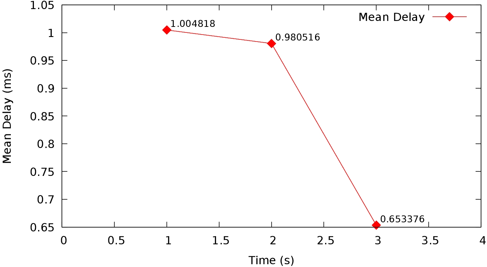

<h1>NS-3 Wireless Network</h1>

<h2>Metrics set for the simulation</h2>

<h4>Fixed parameters</h4>

- Number of transmitted UDP packets (21972) per link flow;
- Bytes transmitted (11864880);
- Packet size (default 512 Bytes);
- DataRate of 10 Mpbs of the Stations;
- Total simulation time set to 10 seconds;
- Port 9 and 49153 for respectively the server (AP) and the client (Stations)

<h4>Variable parameters</h4>

- Propagation loss between transmitter and receiver (range)

<h2>Simulation</h2>

<h2>Gnuplot</h2>

  
  

